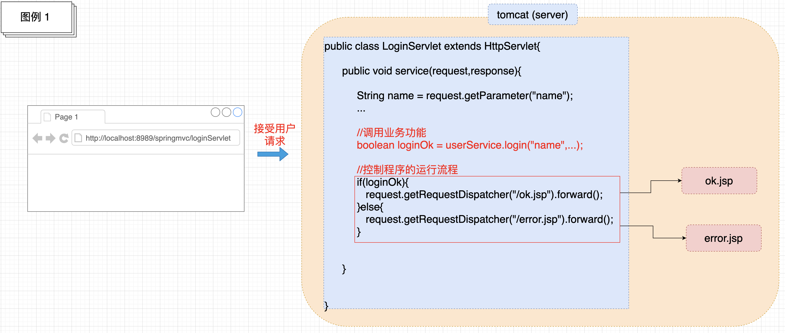
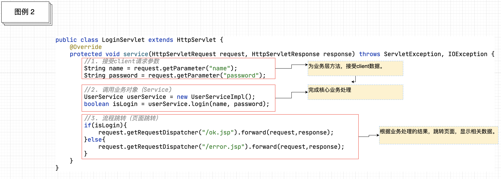
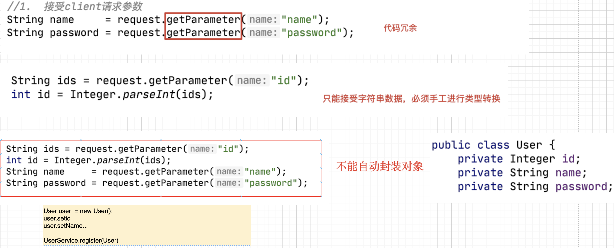
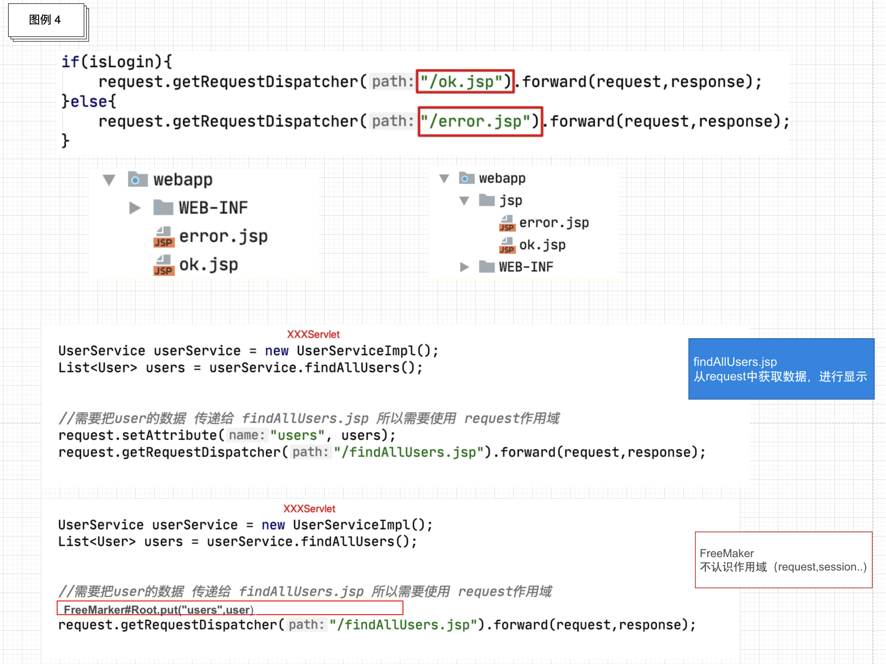

### 百知教育 — SpringMVC系列课程

---

#### 第一章、SpringMVC的引言

##### 1.1 什么是SpringMVC

```markdown
1. 概念： SpringMVC是基于Spring Framework衍生而来的一个MVC框架。主要解决了原有MVC框架开发过程中,控制器（Controller)的问题。
```

- **SpringMVC是一个MVC框架**

  ```markdown
  1. MVC是一个架构思想，在JavaEE开发中多用于Web开发。
  2. 应用MVC架构思想开发应用，会把一个项目划分为了3个层次，M(Model) 模型层,V(View) 视图层,C(Controller) 控制层。
  		View       JSP
  		Model      Service+DAO
  		Controller Servlet
  3. MVC这种分层开发，体现了面向对象各司其职的设计思想，也更加有利于后续的项目维护（修改）。    
  ```

- **为什么要基于Spring Framework**

  - 通过工厂(容器)创建对象，解耦合 (IOC DI)。
  - 通过AOP的方式，为目标类(原始类)，增加额外功能。
  - 方便与第三方框架的集成
    - MyBatis
    - JPA
    - MQ

- **原有MVC开发中控制器存在的问题**

  ```markdown
  1. 原有MVC开发中的控制器是通过哪些技术实现的？
  2. 这些技术在实现控制器时，存在着哪些问题？
  ```

  - **原有控制器的实现技术**

    - Servlet [基于Java Model2模式]
    - Struts2中的Action

  - **Servlet实现控制器存在的问题**

    - **控制器的核心作用**

      ```markdown
      1. 接受用户的请求，调用业务功能（Service)，并根据处理结果控制程序的运行流程。
      ```

      

    - **控制器的核心代码**

      ```markdown
      1. 接受client请求参数
      2. 调用业务对象（Service)
      3. 流程跳转（页面跳转）
      ```

      

    - **控制器存在的问题**

      - 接受client请求参数

        ```markdown
        1. 代码冗余
        2. 只能接受字符串类型的数据，需要手工进行类型转换
        3. 无法自动封装对象
        ```

        

      - 调用业务对象（Service)

        ```java
        UserService userService = new UserServiceImpl(); //耦合代码
        boolean isLogin = userService.login(name,password);
        ```

        ```markdown
        1. 通过new的方式获得业务对象（service)，存在耦合
        ```

      - 流程跳转(页面跳转)

        ```markdown
        1. 跳转路径耦合
        2. 与视图层技术的耦合
        ```

        


##### 1.2  SpringMVC课程的学习要点

###### 1.2.1 SpringMVC的三种开发模式

- **传统视图开发【基础课程讲解】**

  ```markdown
  1. 通过作用域（request,session)进行数据的传递。
  2. 通过视图层技术进行数据的展示（JSP,FreeMarker,Thymeleaf)。
  ```

- **前后端分离开发【MVC高级课程讲解】**

  ```markdown
  1. 多种新的请求发送方式
  2. Restful的访问
  3. 通过HttpMessageConverter进行数据响应
  ```

- **Spring5 WebFlux开发【独立课程讲解】**

  ```markdown
  1. 替换传统JavaWeb开发的一种新的Web开发方式。
  2. 通过NettyServer,进行Web通信。
  ```

###### 1.2.2 控制器开发

```markdown
1. 接受client请求参数
2. 调用业务对象
3. 流程跳转
```


