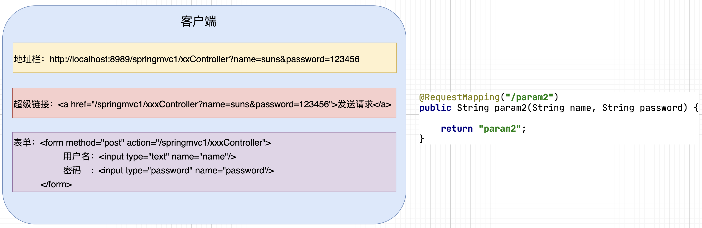
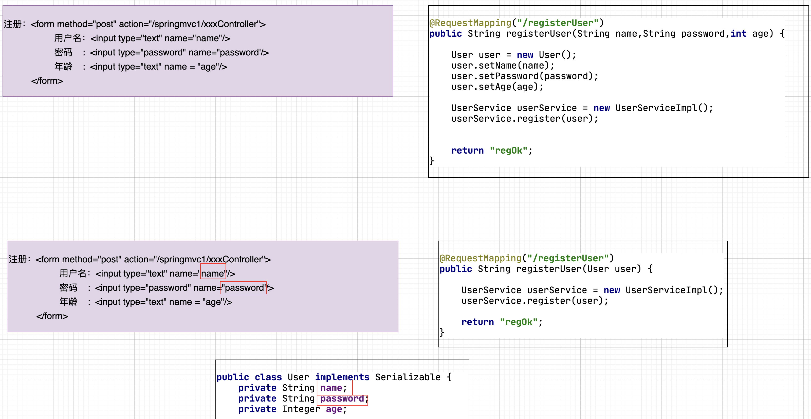
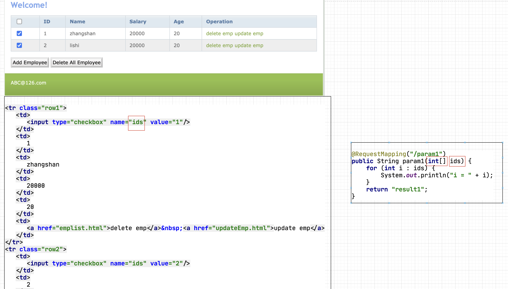
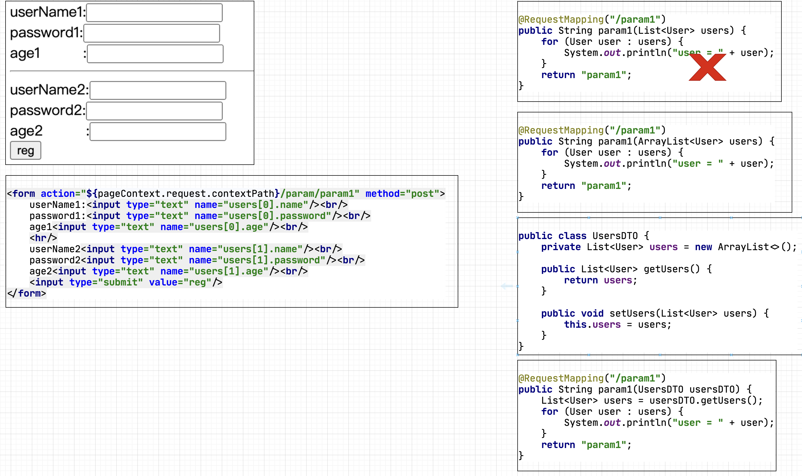
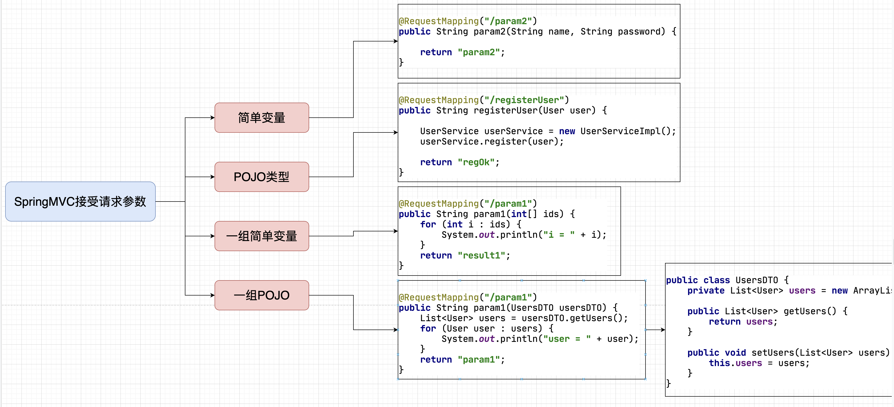
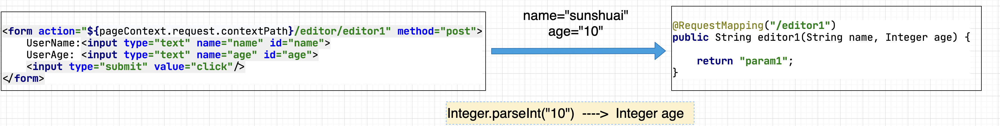
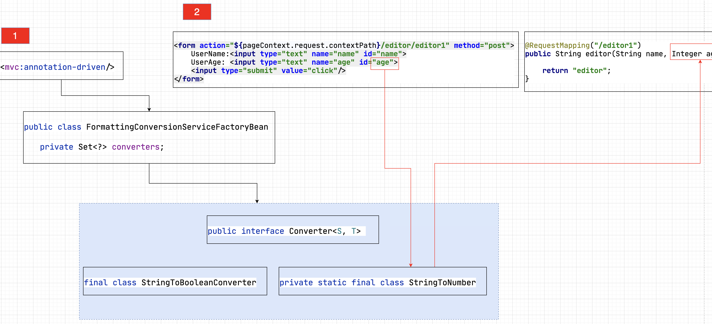
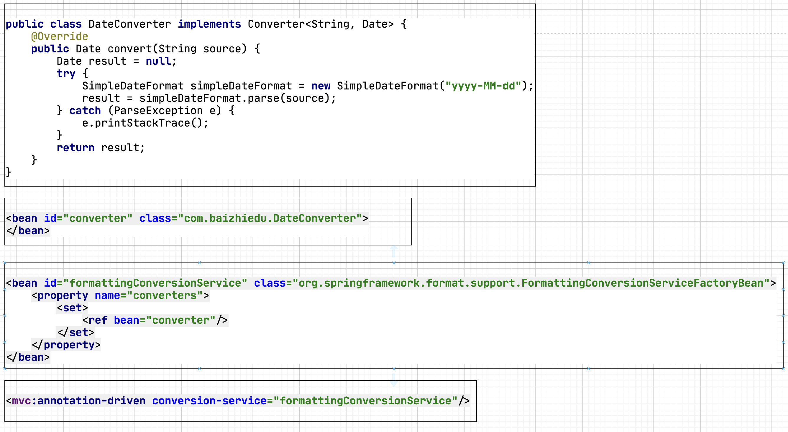
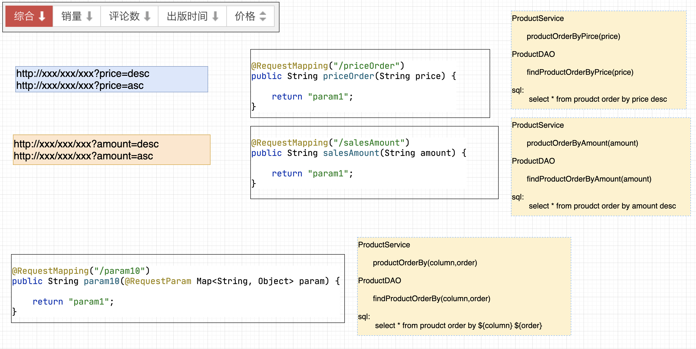

### 百知教育 — SpringMVC系列课程

---

#### 第三章、SpringMVC控制器开发详解 一

##### 3.1 核心要点

> 1. **接受客户端(client)请求参数 [讲解]**
> 2. **调用业务对象**
> 3. **流程跳转**

##### 3.2 控制器接受客户端(client)请求参数详解

###### 3.2.1 回顾：Web开发中如何接受Client请求参数


###### 3.2.2 基于Servlet API接受Client请求参数

```java
 String name     = request.getParameter("name");
 String password = request.getParameter("password");


@Controller
@RequestMapping("/param")
public class ParamController {

    @RequestMapping("/param1")
    public String param1(HttpServletRequest request, HttpServletResponse response) {

        String name     = request.getParameter("name");
        String password = request.getParameter("password");

        return "param1";
    }
}

注意：这种方式虽然最为直观、简单、但是代码冗余多且与ServletAPI存在耦合，所以在SpringMVC开发中并不建议使用。
```

###### 3.2.3 基于简单变量接受Client请求参数

~~~markdown
1. 所谓简单变量：指的就是8种基本类型+String这些类型的变量。把这些类型的变量，作为控制器⽅法的形参，⽤于接受client提交的数据。
~~~

- **思路分析**

  

- **代码**

  ```java
  @Controller
  @RequestMapping("/param")
  public class ParamController {
    
      @RequestMapping("/param2")
      public String param2(String name, String password) {
  
          return "param2";
      }
    
  }
  ```

- **细节分析**

  - **常见类型自动转换**

    ```java
    客户端请求：http://localhost:8989/springmvc1/param/param2?name=sunshuai&age=10 
    
    HTTP协议：传递的是 name "sunshuai" age "10"
    
    @Controller
    @RequestMapping("/param")
    public class ParamController {
      
        @RequestMapping("/param2")
        public String param2(String name, int age) {
    
          
            return "param2";
        }
      
    }
    
    SpringMVC底层针对于age接受数据时会自动调用 int age = Integer.parseInt("10");
    ```

    ```markdown
    1. 常见类型泛指：8种基本类型及其包装器，String等常见类型。
    2. Date日期等特殊类型，默认不支持，需要程序员自定义类型转换器【后续讲解】
    ```

  - **基本类型尽量使用包装器**

    ```java
    客户端请求：http://localhost:8989/springmvc1/param/param2?name=sunshuai&age=10
    
              http://localhost:8989/springmvc1/param/param2?name=sunshuai 
    
    @Controller
    @RequestMapping("/param")
    public class ParamController {
      
        @RequestMapping("/param2")
        public String param2(String name, int age) {
    
          
            return "param2";
        }
      
    }
    
    程序报错：原因在于age参数。age在提交数据时没有提交内容，等同于null。而参数中age使用了int类型，是基本类型，无法存储null值，所以产生了错误。
    改正方式：
             1. age参数使用包装器类型，可以存储null值
           2. 为age参数设置默认值，但是需要@RequestParam注解配合使用。【后续讲解】
    ```

###### 3.2.4 基于POJO类型接受Client请求参数

- **什么是POJO**

  ```markdown
  1. POJO全程叫做Plain Ordinary Java Object（简单的Java对象)
  2. POJO类型对象的特点是：
  		1. 类型中如果存在成员变量，必须提供set get方法。
  		2. 提供默认无参构造
  		3. 可以实现Serializable，也可以不实现
  		4. 不实现容器或者框架所规定的接口
  3. 用户根据业务封装的实体、DTO这些类型就是POJO。
  ```

- **使用场景**

  

- **代码**

  ```java
  public class User implements Serializable {
      private String name;
      private String password;
      private Integer age;
  }
  
  @RequestMapping("/param3")
  public String param3(User user) {
  
    return "param3";
  }
  
  http://localhost:8989/springmvc1/xxController?name=suns&password=123456&age=10
  
  <a href="/springmvc1/xxxController?name=suns&password=123456&age=10">发送请求</a>
    
  姓名: <input type="text"     name="name"/>
  密码: <input type="password" name="password'/>
  年龄: <input type="text"     name ="age"/>
    
  POJO的成员变量的名字要和请求参数的key或者表单name属性的值严格对应。
  ```

- **注意1**

  ```java
  http://localhost:8989/springmvc1/xxxController?name=sunshuai&password=123456&age=10
  
  @RequestMapping("/param3")
  public String param3(String name,User user) {
  
    return "param3";
  }
  
  name形参与user对象中的name属性，都会获取对应的内容。这个特点在后续学习前端后端分离开发时，是会使用。
  ```

- **注意2**

  ```markdown
  1. 如果SpringMVC发现控制器形参类型，是8种基本类型+String的话，他会通过形参名与请求参数的key对应，接受数据。
  2. 如果SpringMVC发现控制器形参类型，不是8种基本类型+String的话，他会查找对应形参类型的属性名与请求参数的key对应，接受数据
  3. 如果存在自定义类型转换器不适用于上述规律 【后续讲解】
  ```

###### 3.2.5 接受一组简单变量的请求参数

- **使用场景**

  

- **代码**

  ```java
  @RequestMapping("/param1")
  public String param1(int[] ids) {
    for (int i : ids) {
      System.out.println("i = " + i);
    }
    return "result1";
  }
  ```
  
- **细节分析**

  ~~~java
  @RequestMapping("/param1")
  public String param1(List<Integer> ids) {
    for (Integer id : ids) {
      System.out.println("id = " + id);
    }
    return "result1";
  }
  
  抛出异常：SpringMVC无法提供具体的实现类，实例化形参。
    
  @RequestMapping("/param1")
  public String param1(ArrayList<Integer> ids) {
    for (Integer id : ids) {
      System.out.println("id = " + id);
    }
    return "result1";
  }
  
  没有异常，但是接受不到数据：SpringMVC会按照POJO的匹配方式，进行成员变量查找。
  ~~~
  

###### 3.2.6 接受一组POJO类型对象的请求参数

- **使用场景**

  
  
- **代码**

  ~~~java
  <form action="${pageContext.request.contextPath}/param/param1" method="post">
    userName1:<input type="text" name="users[0].name"/>    <br/>
    password1:<input type="text" name="users[0].password"/><br/>
    age1      <input type="text" name="users[0].age"/>     <br/>
    <hr/>
    userName2<input type="text"  name="users[1].name"/>     <br/>
    password2<input type="text"  name="users[1].password"/> <br/>
    age2     <input type="text"  name="users[1].age"/>      <br/>
      
    <input type="submit" value="reg"/>
  </form>
  
  
  public class UsersDTO {
    private List<User> users = new ArrayList<>();
  
    public List<User> getUsers() {
      return users;
    }
  
    public void setUsers(List<User> users) {
      this.users = users;
    }
  }
        
  @RequestMapping("/param1")
  public String param1(UsersDTO usersDTO) {
    
    List<User> users = usersDTO.getUsers();
    
    for (User user : users) {
      System.out.println("user = " + user);
    }
    
    return "param1";
  }
  ~~~

##### 3.3 接受Client请求参数的总结



##### 3.4 @RequestParam注解

```java
1.	@RequestParam注解：用于修饰控制器方法的形参。
  
    @RequestMapping("/param1")
    public String param1(@RequestParam String name,@RequestParam String password){
  
		}
```

###### 3.4.1 @RequestParam注解详解

- **解决请求参数与方法形参名字不一致的问题**

  ```java
  http://localhost:8989/springmvc1/paramContrller/param?n=sunshuai&p=123456
  
  <a href="/springmvc1/paramController/param?n=sunshuai&p=123456">点击</a>
    
  <form action="/springmvc1/paramController/param" method="post">
     username：<input type="text"    name="n"/>
     password: <input type="password" name="p"/>
  </form>
       
  @RequestMapping("/param1")
  public String param1(@RequestParam（"n") String name,@RequestParam("p") String password){
  
  }
  ```

- **注意**

  ```java
  1.  @RequestParam注解简写形式：不书写value属性的内容，@RequestParam默认会把对应形参名作为value属性的值。
      @RequestMapping("/param1")
      public String param1(@RequestParam("n") String name,@RequestParam("p") String password){
  
      }
      @RequestMapping("/param1")
      public String param1(@RequestParam String name,@RequestParam String password){
  
      }
    
  2. 	使用了@RequestParam注解的形参，客户端必须传递数据，不能省略。否则报错。后面的相关知识点可以解决这个问题。
    
  3. 	POJO类型的形参，不能与@RequestParam注解联用。
  		报400错误
    
  4.	典型的应用场景
      http://localhost:8989/springmvc1/paramContrller/param1?id<=10
      @RequestMapping("/param1")
      public String param1(@RequestParam（"id<") Integer id) {
  
      }
      在前后端分离的开发中会涉及的到
  ```


- **@RequestParam的required属性**

  ```markdown
  1.	在使用@RequestParam注解时，可以应用required属性。
  		required = true时：@RequestParam修饰的控制器方法参数，客户端必须提交数据，否则报错，默认值
  		required = false时:@RequestParam修饰的控制器方法参数，客户端可以传递数，也可以不传递。
  		
  2.	解决使用@RequestParam注解，客户端必须传递数据的问题。
  ```

- **@RequestParam的defaultValue属性**

  - **客户端没有提交数据的时候，给对应的形参提供默认值**

    ~~~java
    http://localhost:8989/springmvc1/paramContrller/param1?name=sunshuai
    
    @RequestMapping("/param1")
    public String param1(@RequestParam String name, @RequestParam(defaultValue = "99999") String password) {
      System.out.println("name = " + name);
      System.out.println("password = " + password);
      return "param1";
    }
    
    注意：如果使用了defaultValue,则required属性也默认被设置成了false
    ~~~

  - **解决控制器方法形参，使用包装器的问题**

    ```java
    客户端请求：http://localhost:8989/springmvc1/param/param2?name=sunshuai 
    
    @Controller
    @RequestMapping("/param")
    public class ParamController {
      
        @RequestMapping("/param2")
        public String param2(String name, int age) {
    
          
            return "param2";
        }
      
    }
    
    解决方案1：
    @Controller
    @RequestMapping("/param")
    public class ParamController {
      
        @RequestMapping("/param2")
        public String param2(String name, Integer age) {
    
          
            return "param2";
        }
      
    }
    
    解决方案2：
    @Controller
    @RequestMapping("/param")
    public class ParamController {
      
        @RequestMapping("/param2")
        public String param2(String name, @RequestParam(defaultValue = "0") int age) {
    
          
            return "param2";
        }
      
    }
    ```

  - **defaultValue典型的使用场景**

    ```java
    默认值操作，一个典型的应用场景是：分页首页查询，不传页号的设计
    
    http://localhost:8989/ems/employee/findAllEmployees
    http://localhost:8989/ems/employee/findAllEmployees?pageNum=2
    http://localhost:8989/ems/employee/findAllEmployees?pageNum=3
    
    @RequestMapping("/findAllEmployees")
    public String findAllEmployees(Model model, @RequestParam(value = "pageNum",defaultValue = "1") Integer pageNum) 
    ```

##### 3.5 中文请求参数的乱码问题

###### 3.5.1 回顾JavaWeb开发中中文乱码的解决方案

- **GET请求乱码的解决方案**

  ```java
  http://localhost:8989/springmvc1/paramContrller/param?name=孙帅&p=123456
  
  
  TOMCAT8以前版本:
  
  $TOMCAT_HOME/conf/server.xml
  
  <Connector port="8080" protocol="HTTP/1.1"
             connectionTimeout="20000"
             redirectPort="8443"
             URIEncoding="UTF-8"/>
  
  TOMCAT8版本及后续版本:
  
  Tomcat8及其后续版本中，修改了Connector相关源码，已经默认支持UTF-8字符集。但是如果使用GBK还需要上述配置
  ```

- **POST请求乱码的解决方案**

  ```java
  <form action="/springmvc1/paramController/param" method="post">
       username：<input type="text"     name="name"/>
       password: <input type="password" name="password"/>
  </form>
         
  底层解决方案：
         request.setCharaceterEncoding("UTF-8")
         
  开发常用方式：
         通过过滤器解决
         
   public class EncodingFilter implements Filter {
    
      @Override
        public void doFilter(ServletRequest req,ServletResponse resp,FilterChain chain){
          HttpServletRequest request = (HttpServletRequest) req;
            request.setCharacterEncoding("UTF-8");
        }
  }
  ```

##### 3.6 SpringMVC的类型转换器

###### 3.6.1 SpringMVC中的内置类型转换器

- **分析**

  

- **内置类型转换器的概念**

  ```markdown
  1.	SpringMVC提供了内置类型转换器，把客户端提交的字符串类型的请求参数，转换成控制器方法参数需要的数据类型。
  
  2.  SpringMVC并不是对于所有的类型，都提供了内置的类型转换器，他只是提供了常见类型的转换器
  				比如：8种基本类型，常见的集合类型等	
  ```

- **原理分析**

  

  ~~~markdown
  1. 在SpringMVC启动时，会通过<mvc:annotation-driven/> 把FormattingConversionServiceFactoryBean。引入到SpringMVC体系中。FormattingConversionServiceFactoryBean存储了SpringMVC中所有的内置类型转换器。后续client提交请求参数时，如果对应控制器方法形参不是字符串类型，那么FormattingConversionServiceFactoryBean就会调用对应的类型转化器，进行类型转换，最终完成控制器方法形参的赋值。
  ~~~


###### 3.6.2 SpringMVC中自定义类型转换器

```markdown
1. SpringMVC在接受客户端提交请求参数时，如果请求参数对应的控制器方法形参，是非常规数据类型，SpringMVC默认情况下无法进行类型转换。会抛出异常，程序员可以通过自定义类型转换器解决上述问题。
		如：日期类型
```

- **思路分析**

  

- **编码**

  ```java
  public class DateConverter implements Converter<String, Date> {
    @Override
    public Date convert(String source) {
      Date result = null;
      try {
        SimpleDateFormat simpleDateFormat = new SimpleDateFormat("yyyy-MM-dd");
        result = simpleDateFormat.parse(source);
      } catch (ParseException e) {
        e.printStackTrace();
      }
      return result;
    }
  }
  
  <!--配置类型转换器，让Spring进行对象的创建-->
  <bean id="converter" class="com.baizhiedu.DateConverter">
  </bean>
  
  <!--进行类型转换器注册，让SpringMVC能够识别日期类型转换的类型转换器-->
  <bean id="formattingConversionService" class="org.springframework.format.support.FormattingConversionServiceFactoryBean">
    <property name="converters">
      <set>
        <ref bean="converter"/>
      </set>
    </property>
  </bean>
  
  <mvc:annotation-driven conversion-service="formattingConversionService"/>
    
    
  <!--上述第一步 第二步写法 还可以合二为一-->
  <bean id="formattingConversionService" class="org.springframework.format.support.FormattingConversionServiceFactoryBean">
    <property name="converters">
      <set>
         <bean id="converter" class="com.baizhiedu.DateConverter"/>
      </set>
    </property>
  </bean>
  ```

##### 3.7 接受其他请求数据

###### 3.7.1 动态参数收集

- **分析**

  ```java
  http://localhost:8989/param/param2/param1?name=sunshuai
  http://localhost:8989/param/param2/param1?name=xiaohei
  
  @RequestMapping("/param10")
  public String param10(String name) {
  
    return "param1";
  }
  ```

- **单值动态参数收集**

  ~~~java
  http://localhost:8989/param/param2/param1?name=sunshuai
  http://localhost:8989/param/param2/param1?age=10
  
  
  @RequestMapping("/param10")
  public String param10(@RequestParam Map<String, String> param) {
  
    return "param1";
  }
  
  注意：如果需要接受动态参数，必须保证Map的形参前面加入@RequestParam注解，否则接受不到数据。
  ~~~

- **多值动态参数收集**

  ```java
  http://localhost:8989/param/param10?id=1&id=2&id=3
  
  第一种解决思路：
    
  @RequestMapping("/param1")
  public String param1(int[] id) {
    for (int i : ids) {
      System.out.println("i = " + i);
    }
    return "result1";
  }
  
  问题：
  http://localhost:8989/param/param10?id=1&id=2&id=3
  http://localhost:8989/param/param10?name=sunshuai1&name=sunshuai2&name=sunshuai3
  
  第二种解决思路：
  
  @RequestMapping("/param11")
  public String param11(@RequestParam MultiValueMap<String, String> params) {
  
    System.out.println("ParamController.param11");
  
    return "param1";
  }
  ```

- **典型应用场景**

  

###### 3.7.2 接受cookie数据

- **Servlet中获取的方式**

  ```java
  #Cookie创建的代码
  Cookie cookie = new Cookie("name","value");
  
  #核心代码
  Cookie[] cookies = request.getCookies();
  for (Cookie cookie : cookies) {
    if ("cookieName".equals(cookie.getName())) {
      System.out.println("cookie.getValue() = " + cookie.getValue());
    }
  }
  ```

- **SpringMVC中获取Cookie**

  ```java
  @RequestMapping("/other1")
  public String other1(HttpServletRequest request) {
    Cookie[] cookies = request.getCookies();
    for (Cookie cookie : cookies) {
      if ("name".equals(cookie.getName())) {
        System.out.println("cookie.getValue() = " + cookie.getValue());
      }
    }
    return "other1";
  }
  
  # 第一种基于Servlet API获取Cookie，存在与Servlet API的耦合问题，不建议后续使用
    
  
  @RequestMapping("/other2")
  public String other2(@CookieValue("name") String cookieValue) {
    System.out.println("OtherController.other1 "+cookieValue );
    return "other2";
  }
  ```

###### 3.7.3 接受请求头数据

- **什么是请求头**

  ```markdown
  1. 	Http协议规定：客户端浏览器在发起请求时，除了提交数据外，还会通过请求头向服务器端提交一些额外的附加息。
  		比如语言信息，浏览器的版本，客户端操作系统类型，是否缓存数据等信息。
  
  2.  在后续的开发中，特殊场景下，甚至会自定义请求头携带一些特殊数据。
  ```

- **获取请求头的方式**

  - **Servlet中的获取方式**

    ```java
    #核心代码
    String value = request.getHeader("key");
    ```

  - **SpringMVC中的获取方式**

    ```java
    @RequestMapping("/other3")
    public String other3(HttpServletRequest request) {
      String host = request.getHeader("host");
      System.out.println("host = " + host);
      return "other3";
    }
    
    # 第一种基于Servlet API获取请求头，存在与Servlet API的耦合问题，不建议后续使用
    
    @RequestMapping("/other4")
    public String other4(@RequestHeader("host") String host) {
      System.out.println("@RequestHeader host = " + host);
      return "other4";
    }
    ```

    


