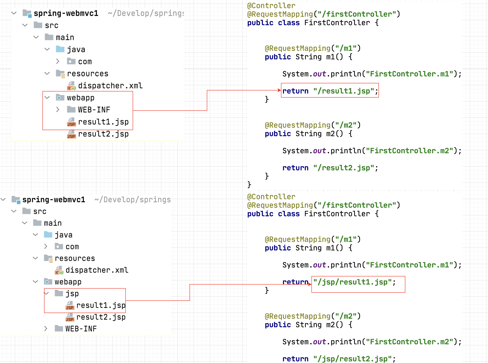

### 百知教育 — SpringMVC系列课程

---

#### 第二章、第一个SpringMVC程序的开发

##### 2.1 开发版本

```markdown
1. JDK1.8+
2. Maven3.6+
3. IDEA2021+
4. SpringFramework 5.1.4 
5. Tomcat8.5.29
6. MySQL5.7.18
```

##### 2.2 环境搭建

###### 2.2.1 **引入相关相关jar**

```xml
<dependency>
  <groupId>org.springframework</groupId>
  <artifactId>spring-webmvc</artifactId>
  <version>5.1.14.RELEASE</version>
</dependency>

<dependency>
  <groupId>javax.servlet</groupId>
  <artifactId>javax.servlet-api</artifactId>
  <version>3.1.0</version>
  <scope>provided</scope>
</dependency>

<dependency>
  <groupId>javax.servlet</groupId>
  <artifactId>jstl</artifactId>
  <version>1.2</version>
</dependency>

<dependency>
  <groupId>javax.servlet.jsp</groupId>
  <artifactId>javax.servlet.jsp-api</artifactId>
  <version>2.3.1</version>
  <scope>provided</scope>
</dependency>

<dependency>
  <groupId>org.springframework</groupId>
  <artifactId>spring-web</artifactId>
  <version>5.1.14.RELEASE</version>
</dependency>

<dependency>
  <groupId>org.springframework</groupId>
  <artifactId>spring-core</artifactId>
  <version>5.1.14.RELEASE</version>
</dependency>

<dependency>
  <groupId>org.springframework</groupId>
  <artifactId>spring-beans</artifactId>
  <version>5.1.14.RELEASE</version>
</dependency>

<dependency>
  <groupId>org.springframework</groupId>
  <artifactId>spring-test</artifactId>
  <version>5.1.14.RELEASE</version>
</dependency>

<dependency>
  <groupId>org.springframework</groupId>
  <artifactId>spring-tx</artifactId>
  <version>5.1.14.RELEASE</version>
</dependency>

<dependency>
  <groupId>org.springframework</groupId>
  <artifactId>spring-jdbc</artifactId>
  <version>5.1.14.RELEASE</version>
</dependency>

<dependency>
  <groupId>org.mybatis</groupId>
  <artifactId>mybatis-spring</artifactId>
  <version>2.0.2</version>
</dependency>

<dependency>
  <groupId>com.alibaba</groupId>
  <artifactId>druid</artifactId>
  <version>1.1.18</version>
</dependency>

<dependency>
  <groupId>mysql</groupId>
  <artifactId>mysql-connector-java</artifactId>
  <version>5.1.48</version>
</dependency>

<dependency>
  <groupId>org.mybatis</groupId>
  <artifactId>mybatis</artifactId>
  <version>3.4.6</version>
</dependency>

<dependency>
  <groupId>junit</groupId>
  <artifactId>junit</artifactId>
  <version>4.13</version>
  <scope>test</scope>
</dependency>

<dependency>
  <groupId>org.springframework</groupId>
  <artifactId>spring-context</artifactId>
  <version>5.1.4.RELEASE</version>
</dependency>

<dependency>
  <groupId>org.springframework</groupId>
  <artifactId>spring-aop</artifactId>
  <version>5.1.14.RELEASE</version>
</dependency>

<dependency>
  <groupId>org.aspectj</groupId>
  <artifactId>aspectjrt</artifactId>
  <version>1.8.8</version>
</dependency>

<dependency>
  <groupId>org.aspectj</groupId>
  <artifactId>aspectjweaver</artifactId>
  <version>1.8.3</version>
</dependency>

<dependency>
  <groupId>org.slf4j</groupId>
  <artifactId>slf4j-api</artifactId>
  <version>1.7.25</version>
</dependency>

<dependency>
  <groupId>org.slf4j</groupId>
  <artifactId>jcl-over-slf4j</artifactId>
  <version>1.7.25</version>
</dependency>

<dependency>
  <groupId>ch.qos.logback</groupId>
  <artifactId>logback-classic</artifactId>
  <version>1.2.3</version>
</dependency>

<dependency>
  <groupId>ch.qos.logback</groupId>
  <artifactId>logback-core</artifactId>
  <version>1.2.3</version>
</dependency>

<dependency>
  <groupId>org.logback-extensions</groupId>
  <artifactId>logback-ext-spring</artifactId>
  <version>0.1.4</version>
</dependency>

<dependency>
  <groupId>org.yaml</groupId>
  <artifactId>snakeyaml</artifactId>
  <version>1.25</version>
</dependency>
```

> **注意 SpringMVC比前面我们所学习的Spring，就多引入了一个jar包，叫做spring-webmvc.jar**

###### 2.2.2 配置文件

> **SpringMVC的配置文件,就是Spring的配置文件。**

```markdown
1. 名字可以随便命名,本次课程取名dispatcher.xml。
2. 放置路径可以根据需要，随意放置,本次课程放置在资源目录的根下。
```


###### 2.2.3 **初始化配置**

- **web.xml**

  ```xml
  <servlet>
    <servlet-name>dispatcher</servlet-name>
    <servlet-class>org.springframework.web.servlet.DispatcherServlet</servlet-class>
    <!--用于配置SpringMVC的配置文件-->
    <init-param>
      <param-name>contextConfigLocation</param-name>
      <param-value>classpath:dispatcher.xml</param-value>
    </init-param>
    <!--设置servlet在Tomcat启动时自动加载创建-->
    <load-on-startup>1</load-on-startup>
  </servlet>
  
  <servlet-mapping>
    <servlet-name>dispatcher</servlet-name>
    <url-pattern>/</url-pattern>
  </servlet-mapping>
  ```

  **DispatcherServlet**

  ```markdown
  1. DispatcherServlet称为前端控制器（中央控制器）
  2. DispatcherServlet的核心作用：
  		1. 用于创建Spring的工厂（容器）。
  		   ApplicationContext ctx = new ClassPathXmlApplicationContext("dispatcher.xml");
  		   因为DispatcherServlet封装的Spring工厂（容器）只能读取xml，所以无法迁移到纯注解编程
  		2. 控制SpringMVC内部的运行流程。
  ```

  **SpringMVC的配置文件dispacher.xml**

  ```xml
  <mvc:annotation-driven/>
  
  <context:component-scan base-package="com.baizhiedu"/>
  ```

  **mvc:annotation-driven**
  
  ```markdown
  # <mvc:annotation-driven/> 这段配置的主要作用：引入SpringMVC的核心功能。 
  # 主要引入了2个核心类型
  # 1.RequestMappingHandlerMapping
  # 2.RequestMappingHandlerAdapter
  
  1. RequestMappingHandlerMapping实现了HandlerMapping接口【了解】
  		它会处理@RequestMapping注解，并将其注册到请求映射表中。
  2. RequestMappingHandlerAdapter实现了 HandlerAdapter接口【了解】
  		它是处理请求的适配器，确定调用某个符合要求的控制器类中具体服务的方法。
  ```
  
  **SpringMVC对mvc:annotation-driven的封装**
  
  
  
  **context:component-scan**
  
  ```markdown
  1. 进行注解扫描
  2. DispatcherServlet所创建的工厂需要读取XML的配置文件，不能使用纯注解的开发。所以目前使用Spring配置文件+基础注解的形式，进行开发。
  		基础注解：@Component,@Service,@Repository,@Controller,@Scope,@Transactional等
  		高级注解：@Configuration,@Bean,@ComponentScan等
  		后续SpringMVC高级版的课程，会使用纯注解版开发，与SpringBoot的使用方式高度一致。
  ```

##### 2.3 编码开发

###### 2.3.1 思路分析


```markdown
#  基本流程
1. 开发一个类在上面加入@Controller注解
2. 提供一个控制器方法:参数是HttpServletRequest,HttpServletResponse,返回值是String的，同时加入@RequestMapping注解定义请求路径
3. 在控制方法中，完成核心开发功能，把对应JSP页面的路径，作为方法的返回值返回。
```

###### 2.3.2 编码

```java
@Controller
public class FirstController {

  @RequestMapping("/first")
  public String first(HttpServletRequest request, HttpServletResponse response) {

    System.out.println("FirstController.first");

    return "/result.jsp";
  }
}

必须要进行@Controller注解的扫描，<context:component-scan base-package="com.baizhiedu"/>
```

###### 2.3.3 一个控制器中，提供多个服务方法

- **Servlet作为控制器，一个类中只能提供一个服务方法**

  ```markdown
  1. Servlet开发中，明确控制器的方法必须实现接口规定的service(HttpServletRequest,HttpServletResponse)方法，一个类中是能实现一次，所以一个类中只能有一个服务方法。
  ```

  ```java
  http://localhost:8989/basic/loginServlet
  
  public class LoginServlet extends HttpServlet {
      @Override
      protected void service(HttpServletRequest request, HttpServletResponse response) 
                                                         throws ServletException, IOException {
      
      }
  }
  ```

- **SpringMVC的控制器，一个类中可以提供多个对外服务的方法**

  ```markdown
  1. SpringMVC控制器，没有对于方法名字的限制，所以可以提供多个服务方法
  ```

  ```java
  http://localhost:8989/basic/first
  
  http://localhost:8989/basic/second
  
  @Controller
  public class FirstController {
  
    @RequestMapping("/first")
    public String first(HttpServletRequest request, HttpServletResponse response) {
  		//第一个控制器功能
      return "/result.jsp";
    }
    
    @RequestMapping(value="/second") //在注解使用时，如果只有一个value属性的话，value属性名，可以省略。
    public String second(HttpServletRequest request, HttpServletResponse response) {
      //第二个控制器功能
      return "/result.jsp";
    }
    
  }
  ```

###### 2.3.4 注意

```markdown
1. SpringMVC我们开发的Controller，也称之为Handler（SpringMVC内部的叫法）
```

##### 2.4 第一个程序的细节分析

###### 2.4.1 一种类型的SpringMVC控制器被创建几次

```markdown
1. 回顾:Servlet控制器被创建的次数
		一种类型的Servlet，只会被Tomcat创建一次，所以Servlet是单实例的。
		
2. Servlet是单实例并不是单例设计模式

3. SpringMVC的控制器被Spring创建的次数
		可以只创建一次，也可以创建多次，默认是只创建一次。
		控制器创建的次数，是由@Scope注解决定的。
		
4. 默认情况下SpringMVC的控制器只会被创建一次，会存在线程安全的问题。
```

###### 2.4.2 @RequestMapping注解

```java
1. 核心作用：为控制器方法提供外部访问的url路径。
  
 http://localhost:8989/basic/first

 @RequestMapping("/first")
 public String first(HttpServletRequest request, HttpServletResponse response) 
 
```

- **路径分割符  / 可以省略**

  ```java
  http://localhost:8989/spring-mvc1/first
  
  @RequestMapping("first")
  public String first(HttpServletRequest request, HttpServletResponse response) 
  
  http://localhost:8989/spring-mvc1/first/third
  
  @RequestMapping("first/third")
  public String first(HttpServletRequest request, HttpServletResponse response) 
  
  #注意 多级目录开头可以不写 / 
  ```

- **在一个控制器方法上映射多个路径**

  **应用方式**

  ```java
  http://localhost:8989/basic/first
  http://localhost:8989/basic/third
  
  @Controller
  public class FirstController {
  
    @RequestMapping(value={"/first","/third"})
    public String first(HttpServletRequest request, HttpServletResponse response) {
  
      System.out.println("FirstController.first");
  
      return "/result.jsp";
    }
  }
  ```

- **Controller类上加入@RequestMapping注解**

  **应用方式**

  ```java
  http://localhost:8989/basic/user/addUser
  
  http://localhost:8989/basic/user/deleteUser
  
  @Controller
  @RequestMapping("/user")
  public class UserController {
    
      @RequestMapping("/addUser")
      public String addUser() {
          System.out.println("UserController.addUser");
          return "/index.jsp";
      }
  
      @RequestMapping("/deleteUser")
      public String deleteUser() {
          System.out.println("UserController.deleteUser");
          return "/index.jsp";
      }
  }
  ```

  **设计目的**

  

  **结论**

  ```markdown
  1. 可以更好的按照功能，进行不同模块的区分,有利于项目的管理。
  ```

- **@RequestMapping限定用户的请求方式**

  - **请求方式**

    ```markdown
    1. 所谓请求方式指的就是Web开发中的 POST请求与GET请求
    ```

    **回顾:Web开发中的POST请求与GET请求的区别**

    **两种请求提交数据的区别**

    ```java
    1. GET请求:通过请求行(地址栏)提交数据(QueryString)，明文数据提交，不安全，提交的数据量小(不能超过2048字节)
      
    		http://localhost:8989/basic/user/queryUser?name=sunshuai&password=123456
    
    2. POST请求: 通过请求体提交数据，密文提交（不是加密，指的是一般用户不可见），相对安全，提交数据量大(理论上没有限制)
    ```

    **两种请求发起方式的区别**

    ```java
    1. GET方式
       浏览器地址栏:  http://localhost:8989/basic/firstController/first
    
       超级链接:     <a href="${pageContext.request.contextPath}/firstController/first">超级链接</a>
    
       表单:        <from action="${pageContext.request.contextPath}/firstController/first"></form>
                   
       javascript: location.href=;
    
       ajax:       $.ajax({url:url,type:"get",...})
         
       专属工具或者库：POSTMAN、POSTWOMAN、RestfulToolKits、RestTemplate、HttpClient、OKHttp、NSMutableURLRequest
    
    2. POST方式
       表单:       <from action="${pageContext.request.contextPath}/firstController/first" method="post"></form>
    
       ajax:      $.ajax({url:url,type:"post",...})
         
       专属工具或者库：POSTMAN、POSTWOMAN、RestfulToolKits、RestTemplate、HttpClient、OKHttp、NSMutableURLRequest
    ```

  - **@RequestMapping限定用户的请求方式**

    ```java
    1. 默认情况下:@RequestMapping注解，接受所有请求方式的访问（Post,Get,....）
    
    2. 通过@RequestMapping注解可以限定，某个控制器方法只接受特定的请求方式
    		@RequestMapping(method={RequestMethod.POST})
    		public String xxx(HttpServletRequest,HttpServletResponse)
    		
    		@RequestMapping(method={RequestMethod.GET})
    		public String xxx(HttpServletRequest,HttpServletResponse)
    		
    3. @RequestMapping注解可以同时限定多种请求方式的访问
    		@RequestMapping(method={RequestMethod.GET,RequestMethod.POST})
    		public String xxx(HttpServletRequest,HttpServletResponse)
    
    4. 当用户发起了@RequestMapping不支持的请求操作
    		SpringMVC在服务器端抛出一个405错误 Method Not Allowed
    ```

  - **Http协议中其他的请求方式【了解】**

    ```java
    1. 除常规的POST，GET请求外，Http协议还提供了其他的请求方式
    		PUT、DELETE、OPTIONS...
    		
    2. @RequestMapping注解，默认情况下也支持其他请求方式的访问，同时也可以根据需要进行限定。
    		@RequestMapping(method={RequestMethod.DELETE})
    		public String xxx(HttpServletRequest,HttpServletResponse)
    		
    3. 除Post,Get这2种请求方式外，其他的请求方式浏览器支持的不好，可以使用专属工具或者库进行测试
    
    4. 其他的请求方式，大多数不支持响应视图技术（JSP,Thymeleaf),只能返回简单字符串或者JSON数据。
    ```


###### 2.4.3 控制器方法参数

```markdown
1. SpringMVC在控制器方法参数设计的过程中，非常灵活，可以支持多种参数的设置方式，非常强大，它也把这种设计，叫做数据绑定。
```

- **代码一**

  ```java
  @RequestMapping("/first")
  public String first(HttpServletRequest request, HttpServletResponse response)
  ```

- **代码二**

  ```java
  @RequestMapping("/first")
  public String first(HttpServletRequest request)
  ```

- **代码三**

  ```java
  @RequestMapping("/first")
  public String first(HttpServletResponse response)
  ```

- **代码四**

  ```java
  @RequestMapping("/first")
  public String first(HttpServletRequest request, HttpServletResponse response,HttpSession session)
  
  注意：HttpSession也可以单独使用 或者 组合使用 
       ServletContext(application) 不能应用在控制器方法中，做形参
    	 session.getServletContext();
  		 request.getSession().getServletContext();
  ```

- **代码五**

  ```java
  @RequestMapping("/first")
  public String first()
  ```

  **思考：**

  ```markdown
  1. 上述五种代码形式,在后续开发中，那种更加常用？
  		前四种不推荐的原因是：与Servlet API 解耦合。
  		第五种不推荐的原因是：单纯这种方式使用，无法接受client的请求参数
  		
  		后续的课程中，还会进行详细讲解
  ```

###### 2.4.4 视图解析器（页面跳转）

- **目前页面跳存在的问题**

  ```markdown
  1. 控制器中的跳转路径与实际视图路径存在耦合。
  ```

  

- **视图解析器ViewResolver**

  ```markdown
  1. 通过视图解析器(ViewResolver)，就可以解决跳转路径与实际视图路径耦合的问题。
  ```

  - **思路分析**

    

  - **开发步骤**

    **配置文件开发**

    ```java
    <bean id="resolver" class="org.springframework.web.servlet.view.InternalResourceViewResolver">
         <!--路径-->
         <property name="prefix" value="/"/>
         <!--文件类型-->
         <property name="suffix" value=".jsp"/>
    </bean>
    
    @Controller
    public class FirstController {
    
      @RequestMapping("/first")
      public String first(HttpServletRequest request, HttpServletResponse response) {
    
        System.out.println("FirstController.first");
    
        return "result"; //实际处理时 SpringMVC就会把视图解析器与控制器方法中的逻辑视图名进行拼接 / result .jsp
      }
    }
    ```

    **注解开发**

    ```java
    @Configuration
    public class AppConfig {
        @Bean
        public ViewResolver viewResolver() {
            InternalResourceViewResolver viewResolver = new InternalResourceViewResolver();
            viewResolver.setPrefix("/");
            viewResolver.setSuffix(".jsp");
            return viewResolver;
        }
    }
    
    注意：
         1. AppConfig配置Bean应该放置到<context:component-scan/> 扫描的路径下。
         2. 结合前面所讲，目前因为DispatcherServlet封装的Spring工厂（容器）只能读取xml，所以无法进行纯注解替换。 
    ```
  

###### 2.4.5 SpringMVC配置文件的默认设置【了解】

```xml
1. 如果在web.xml中没有设置SpringMVC配置文件的的路径,系统会查找默认配置文件
	 <servlet>
     <servlet-name>dispatcher</servlet-name>
     <servlet-class>org.springframework.web.servlet.DispatcherServlet</servlet-class>
     <!--
     <init-param>
       <param-name>contextConfigLocation</param-name>
       <param-value>classpath:dispatcher.xml</param-value>
     </init-param>
     -->
     <load-on-startup>1</load-on-startup>
   </servlet>
   <servlet-mapping>
     <servlet-name>dispatcher</servlet-name>
     <url-pattern>/</url-pattern>
   </servlet-mapping>

2. SpringMVC默认配置文件的名字，放置位置是
   /WEB-INF/[servlet-name]-servlet.xml
   
   根据上述配置:SpringMVC配置文件的默认名字是
   /WEB-INF/dispatcher-servlet.xml
```


​	


