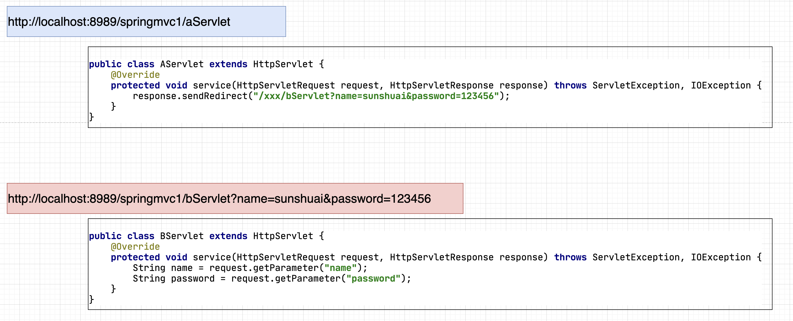
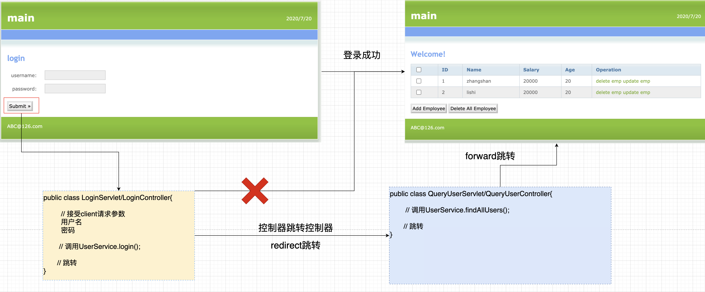
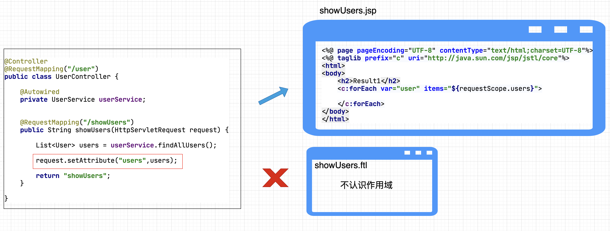
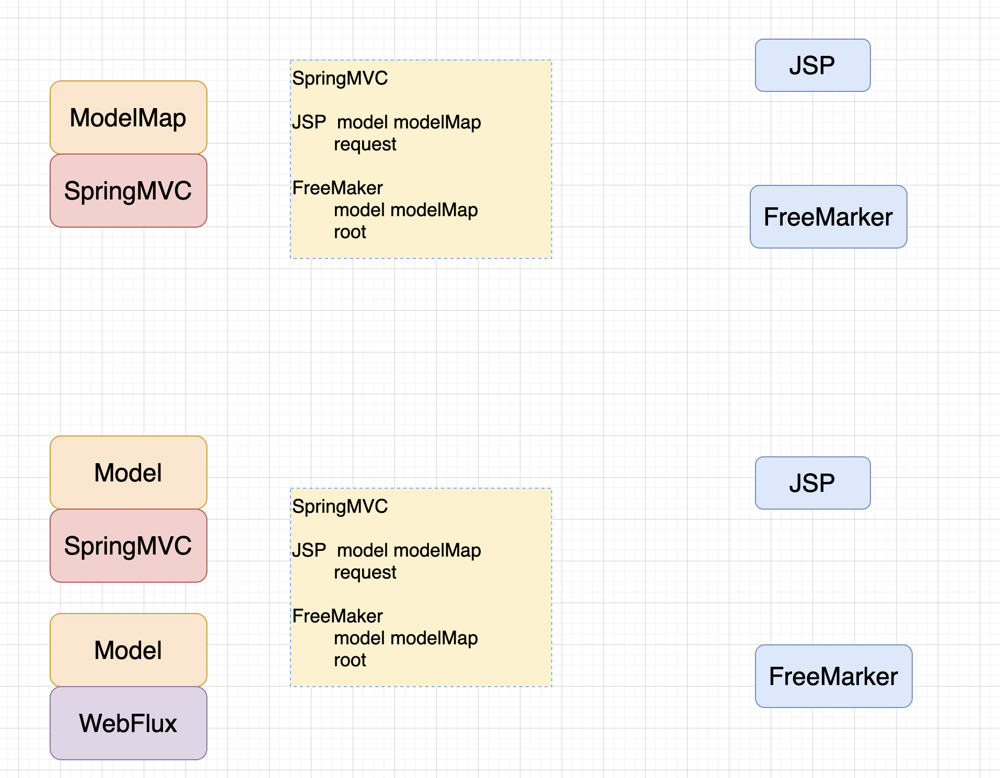

### 百知教育 — SpringMVC系列课程

---

#### 第五章、SpringMVC控制器开发详解 三

##### 5.1 核心要点

>1. **接受客户端(client)请求参数 [讲解完毕]**
>2. **调用业务对象[讲解完毕]**
>3. **流程跳转[讲解]**

##### 5.2 JavaWeb中流程跳转的回顾

###### 5.2.1 JavaWeb中流程跳转的核心代码

~~~java
public class ScopeServlet extends HttpServlet {
    @Override
    protected void service(HttpServletRequest request, HttpServletResponse response) throws ... {
        //1 接受client请求参数
        //2 调用业务对象

        //3   流程跳转
      
        //3.1 作用域操作
        request.setAttribute("request-data","requestData");

        HttpSession session = request.getSession();
        session.setAttribute("session-data","sessionData");

        ServletContext application = session.getServletContext();
        application.setAttribute("application-data","applicationData");

        //3.2   页面跳转
        //3.2.1 forward跳转
        request.getRequestDispatcher("/result.jsp").forward(request,response);
        
        //3.2.2 redirect跳转
        response.sendRedirect("/result.jsp");
    }
}
~~~

###### 5.2.2 JavaWeb页面跳转方式回顾

~~~java
1. 核心区别
    forward:
        1. 一次请求
        2. 地址栏不变
        3. 可以通过request作用域传递数据

    redirect:
        1. 多次请求
        2. 地址栏改变
        3. 不能通过request作用域传递数据
        4. 可以跨域跳转
          
2. 如何选择
		1. 如果本次功能需求，已经完成，则使用redirect跳转
		2. 如果本次功能需求，没有完成，则使用forward 跳转
      
3. redirect跳转传递数据的错误认知
     1.观点：redirect跳转传递数据，因为他是多次请求，所以不能使用request作用域传递数据。解决方式：使用HttpSession[❎]
     
     2.原因：HttpSession只能存储与用户息息相关的数据（用户特有的数据）,用于会话追踪。
            非用户相关的数据，不能用Session存储。
            如果非用户相关的数据，用Session存储，会大量侵占系统内存资源。
     
     3.解决方式：
            通过url拼接?的形式，完成redirect跳转的数据传递。  
~~~



##### 5.3 SpringMVC的四种跳转形式

```markdown
1. 四种跳转指的是：在SpringMVC中控制器与JSP或者控制器与控制器之间的跳转。
		1. Controller -- forward  --> JSP
		2. Controller -- redirect --> JSP
		3. Controller -- forward  --> Controller
		4. Controller -- redirect --> Controller
		
2. SpringMVC的四种跳转，底层上就是对Servlet跳转的封装。
   
3. 默认情况下SpringMVC中控制器通过视图解析器跳转到JSP页面，通过的是forward形式。
```

###### 5.3.1 控制器forward页面

- **编码**

  ```java
  方式1
  @RequestMapping("/m1")
  public String m1() {
  
    System.out.println("FirstController.m1");
  
    return "result1";
  }
  
  // 结合ViewResolver的前缀（prefix）、后缀（suffix）进行拼接成完整的页面，并进行forward跳转
  
  
  方式2
  @RequestMapping("/m1")
  public String m1() {
  
    System.out.println("FirstController.m1");
  
    return "forward:/result1.jsp";
  }
  
  // 使用了forward:关键字，视图解析器的拼接会失效。所以必须写完整路径。
  ```

###### 5.3.2 控制器redirect页面

- **编码**

  ```java
  @RequestMapping("/m1")
  public String m1() {
  
    System.out.println("FirstController.m1");
  
    return "redirect:/result1.jsp";
  }
  
  // 使用了redirect:关键字，视图解析器的拼接会失效。所以必须写完整路径。
  ```

###### 5.3.3 控制器forward控制器

- **是否存在控制器间相互跳转的需求**

  

- **编码**

  ```java
  http://localhost:8989/springmvc1/firstController/forward1
  
  @Controller
  @RequestMapping("/forwardController")
  public class ForwardController {
  
      @RequestMapping("/forward1")
      public String forward1() {
  				System.out.println("从forward1开始跳转");
          return "forward:/forwardController/forward2";
      }
  
      @RequestMapping("/forward2")
      public String forward2() {
  				System.out.println("跳转到forward2中")
          return "forward2";// /forward2.jsp
      }
  }
  
  ```

###### 5.3.4 控制器redirect控制器

- **编码**

  ```java
  http://localhost:8989/springmvc1/redirectController/redirect1
  
  @Controller
  @RequestMapping("/redirectController")
  public class RedirectController {
  
      @RequestMapping("/redirect1")
      public String redirect1() {
          System.out.println("从redirect1开始跳转");
          return "redirect:/redirectController/redirect2";
      }
  
      @RequestMapping("/redirect2")
      public String redirect2() {
          System.out.println("跳转到redirect2中");
          return "redirect2";
      }
  }
  ```

##### 5.4 Web作用域处理

###### 5.4.1 JavaWeb中作用域回顾

- **三种作用域及其使用场景回顾**

  ```java
  1. HttpServletRequest[简称request作用域]
     用于组件间跳转时传递数据
     组件指的是 控制器 视图（JSP)
     使用方式:
  		request.setAttribute("name","value");
  		request.getAttribute("name");
    
  2. HttpSession       [简称session作用域]
     不用于组件间跳转时传递数据
     用于用户会话追踪，只能存储与用户相关的个人数据
     如：登录状态、令牌、购物车等
     使用方式:
  		session.setAttribute("name","value");
  		session.getAttribute("name");
    
  3. ServletContext    [简称application作用域]
     全局唯一，框架底层使用，多用于存储全局唯一的对象
     如：Spring的工厂（容器）、Hibernate(JPA)的SessionFactory、MyBatis的SqlSessionFactory等。
     使用方式:
  		application.setAttribute("name","value");
  		application.getAttribute("name");
  
  public class QueryServlet extends HttpServlet{
    
    @Override
    public void service(HttpServletRequest request,HttpServletResponse response)
                                    throws ServletException,IOException{
      
        UserService userService = new UserServiceImpl();
        List<User> users = userService.findAllUsers();
        
        
        request.setAttribute("users",users);
        request.getRequestDispatcher("/show.jsp").forward(request,response);
    } 
  }
  
  show.jsp
       ${users} 获取
  ```

###### 5.4.2 SpringMVC中作用域处理

- **基本使用方式及其存在的问题**

  ```java
  @RequestMapping("/m3")
  public String m3(HttpServletRequest request, HttpSession session) {
    //request作用域
    request.setAttribute("name","value");
    
    //session作用域
    session.setAttribute("name","value");
  
    //application作用域
    //方式1
    ServletContext application1 = request.getSession().getServletContext();
  	application1.setAttribute("name","value");
    
    //方式2
    ServletContext application2 = session.getServletContext();
    application2.setAttribute("name","value");
  
    return "m3";
  }
  
  
  @Controller
  @RequestMapping("/user")
  public class UserController {
  
      @Autowired
      private UserService userService;
  
  
      @RequestMapping("/showUsers")
      public String showUsers(String name,HttpServletRequest request) {
  
          List<User> users = userService.findUsersByName(name);
  
          request.setAttribute("users",users);
          return "showUsers";
      }
  }
  
  show.jsp
       ${users} 获取
    
  存在问题：
        与ServletAPI耦合，同时也与视图模板技术耦合，在SpringMVC中不建议使用。
  ```
  
  

- **SpringMVC中request作用域的处理**

  - **代码**

    ```java
    # 基于Model的方式
    
    @RequestMapping("/scope1")
    public String scope1(Model model) {
     
        //request.setAttribute("user","sunshuai");
      	model.addAttribute("user","sunshuai");
       
         
      return "scope";
    }
    
    #基于ModelMap的方式
    
    @RequestMapping("/scope2")
    public String scope2(ModelMap modelMap) {
     
        //request.setAttribute("user","sunshuai");
      	modelMap.addAttribute("user", "sunshuai");
       
         
      return "scope";
    }
    ```
    
  - **Model、ModelMap相关细节分析**
  
    ```markdown
    1.  通过Model ModelMap进行作用域的处理，就可以解决视图模板技术耦合的问题。
    
    2. 	SpringMVC中提供Model和ModelMap这2种方式处理requst作用域，他们的区别是什么？
    		表现形式上虽然是通过两种开发方式，声明的形参类型不同，一个是Model,另一个是ModelMap。但是在运行时，SpringMVC会动态的提供对应的实现类型，名字是BindingAwareModelMap。所以本质上2者是相同的。
    		
    3. 	那为什么不直接使用BindingAwareModelMap？
    		在源码中SpringMVC不建议使用BindingAwareModelMap。其原因是因为如果直接使用BindingAwareModelMap的话，会存在耦合。MVC开发时使用BindingAwareModelMap，而WebFlux开发时使用的是ConcurrentModel。如果替换Web的实现方案，直接使用BindingAwareModelMap话，不利于项目的维护，得修改代码。所以更加建议使用Model接口处理。
    	
    4. 	SpringMVC为什么会提供二种开发方式？Model、ModelMap这两种开发方式那种方式更加推荐使用？
    		不推荐使用ModelMap，他是SpringMVC2.0引入的类型。当时的设计只是针对于MVC的场景使用，替换作用域。而后续Spring又支持了WebFlux的开发方式。显然使用ModelMap就无法使用了。所以SpringMVC在2.5.1引入了全新设计的接口Model,他既可以兼容传统MVC也可以在WebFlux中使用。更加有利于项目维护。鉴于此更加推荐使用Model的方式。而SpringMVC为了兼容性，所以两者目前都可以使用。
    
    
    5. 	如果redirect跳转，数据该如何传递？
    		SpringMVC会自动的把Model或者ModelMap中的数据，通过？的形式在url上进行拼接，从而传递数据。
    ```
    
    

- **SpringMVC中session作用域的处理**

  - **基本使用方式及其存在的问题**

    ```java
    # 核心代码
    session.setAttribute("name","value");
    
    @RequestMapping("/scope0")
    public String scope0(HttpSession session) {
      session.setAttribute("name", "value");
      return "scope0";
    }
    
    存在问题：
          与ServletAPI耦合，在SpringMVC中不建议使用。
    ```

  - **@SessionAttributes注解**

    - **存储数据**

      ```java
      @Controller
      @RequestMapping("/webScope")
      @SessionAttributes(value = "name")
      public class WebScopeController {
      
          @RequestMapping("/scope1")
          public String scope1(Model model) {
              model.addAttribute("name", "xiaohei");
              return "scope1";
          }
      }
      
      @Controller
      @RequestMapping("/webScope")
      @SessionAttributes(value = {"name","sex"})
      public class WebScopeController {
      
          @RequestMapping("/scope1")
          public String scope1(Model model) {
              model.addAttribute("name", "xiaohei");
              model.addAttribute("age", "10");
              model.addAttribute("sex", "female");
              return "scope1";
          }
      }
      
      @Controller
      @RequestMapping("/webScope")
      @SessionAttributes(value = {"name","sex","address"})
      //目前modelMap或者model中没有address,没有问题，不会报错
      public class WebScopeController {
      
          @RequestMapping("/scope1")
          public String scope1(Model model) {
              model.addAttribute("name", "xiaohei");
              model.addAttribute("age", "10");
              model.addAttribute("sex", "female");
              return "scope1";
          }
      }
      ```

    - **注意**

      ```markdown
      ```

      
