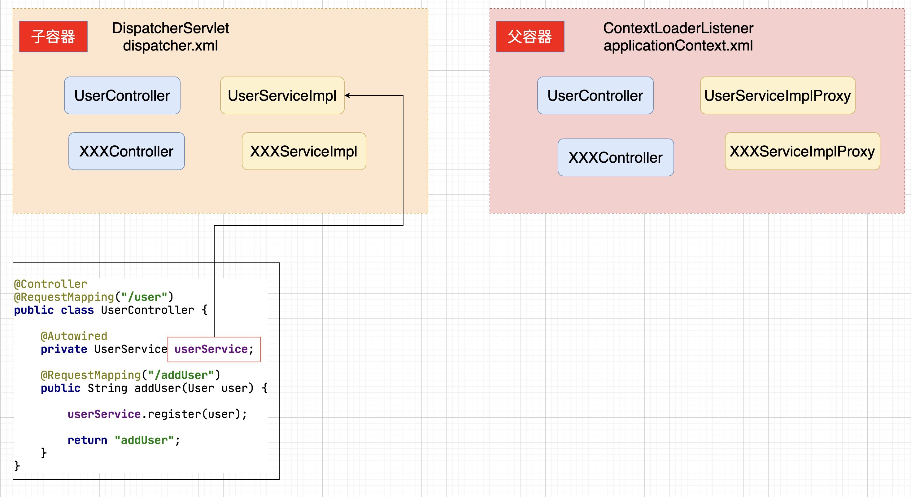

### 百知教育 — SpringMVC系列课程

---

#### 第四章、SpringMVC控制器开发详解 二

##### 4.1 核心要点

> 1. **接受客户端(client)请求参数 [讲解完毕]**
> 2. **调用业务对象[讲解]**
> 3. **流程跳转**

##### 4.2 SpringMVC控制器调用业务对象【SSM整合】

###### 4.2.1 核心思路分析


###### 4.2.2 编码

- **dispatcher.xml**

  ```xml
  <context:component-scan base-package="com.baizhiedu"/>
  
  <mvc:annotation-driven/>
  
  <bean id="resolver" class="org.springframework.web.servlet.view.InternalResourceViewResolver">
    <!--路径-->
    <property name="prefix" value="/jsp/"/>
    <!--文件类型-->
    <property name="suffix" value=".jsp"/>
  </bean>
  
  <bean id="dataSource" class="com.alibaba.druid.pool.DruidDataSource">
    <property name="driverClassName" value="com.mysql.jdbc.Driver"/>
    <property name="url" value="jdbc:mysql://localhost:3306/suns?useSSL=false"/>
    <property name="username" value="root"/>
    <property name="password" value="123456"/>
  </bean>
  
  <bean id="sqlSessionFactoryBean" class="org.mybatis.spring.SqlSessionFactoryBean">
    <property name="dataSource" ref="dataSource"/>
    <property name="typeAliasesPackage" value="com.baizhiedu.entity"/>
    <property name="mapperLocations">
      <list>
        <value>classpath:com.baizhiedu.mapper/*Mapper.xml</value>
      </list>
    </property>
  </bean>
  
  <bean id="mapperScannerConfigurer" class="org.mybatis.spring.mapper.MapperScannerConfigurer">
    <property name="sqlSessionFactoryBeanName" value="sqlSessionFactoryBean"/>
    <property name="basePackage" value="com.baizhiedu.dao"/>
  </bean>
  
  <bean id="transactionManager" class="org.springframework.jdbc.datasource.DataSourceTransactionManager">
    <property name="dataSource" ref="dataSource"/>
  </bean>
  
  <tx:annotation-driven transaction-manager="transactionManager"/>
  ```

- **DAO**

  ```java
  public class User{
    private Integer id;
    private String name;
    private String password;
    set get  
  }
  
  create table t_user(
      id integer primary key auto_increment,
      name varchar(12),
      password varchar(12)
  );
  
  
  public interface UserDAO {
      public void save(User user);
  }
  
  <mapper namespace="com.baizhiedu.dao.UserDAO">
     <insert id="save" parameterType="User">
         insert into t_user (name,password) values (#{name},#{password})
     </insert>
  </mapper>
  ```

- **Service**

  ```java
  public interface UserService {
      public void register(User user);
  }
  
  @Service
  @Transactional
  public class UserServiceImpl implements UserService {
  
      @Autowired
      private UserDAO userDAO;
  
      @Override
      public void register(User user) {
          userDAO.save(user);
      }
  }
  ```

- **Controller**

  ```java
  @RequestMapping("/user")
  public class UserController {
  
      @Autowired
      private UserService userService;
  
      @RequestMapping("/addUser")
      public String addUser(User user) {
  
          userService.register(user);
  
          return "addUser";
      }
  }
  ```

###### 4.2.3  父子工厂（父子容器）拆分

- **现有SSM开发中存在的问题**

  

  ```markdown
  1. 把MVC层的对象（Controller,<mvc:annotation-driven/>,视图解析器）与非MVC层的（连接池 DAO Service 事务），都配置在dispatcher.xml中，最终交给DispatcherServlet创建的工厂来进行实例化，存在着耦合问题，后续一旦替换MVC的实现，代码都会受到影响，不利于项目的维护。
  ```

- **如何解决**

  

  ```markdown
  1. 把目前单一的工厂进行父子工厂的拆分
  
  	1. 	子工厂（容器）（DispatcherServlet),读取dispatcher.xml
  			完成与SpringMVC相关对象的创建：视图解析器、自定义类型转换器、静态资源排除、拦截器、视图控制器等
  	2. 	父工厂（容器）（ContextLoaderListener),读取applicationContext.xml
  			完成与非SpringMVC相关对象的创建：连接池、DAO、Service、事务、MQ、ES、Redis等
  		
  2. 工厂（容器）在需要获取对象进行操作时，首先获取子容器中所创建的对象，如果没有继续获得父容器中所创建的对象
  ```

- **编码**

  - **子工厂（子容器）**
  
    ```xml
    # dispatcher.xml
    # SpringMVC相关的配置
    # 视图解析器、自定义类型转换器、静态资源排除、拦截器、视图控制器等。
    
    <context:component-scan base-package="com.baizhiedu"/>
    
    <mvc:annotation-driven/>
    
    <bean id="resolver" class="org.springframework.web.servlet.view.InternalResourceViewResolver">
      <!--路径-->
      <property name="prefix" value="/jsp/"/>
      <!--文件类型-->
      <property name="suffix" value=".jsp"/>
    </bean>
    
    # web.xml 中子容器的配置
    
    <servlet>
      <servlet-name>dispatcherServlet</servlet-name>
      <servlet-class>org.springframework.web.servlet.DispatcherServlet</servlet-class>
      <init-param>
        <param-name>contextConfigLocation</param-name>
        <param-value>classpath:dispatcher.xml</param-value>
      </init-param>
      <load-on-startup>1</load-on-startup>
    </servlet>
    
    <servlet-mapping>
      <servlet-name>dispatcherServlet</servlet-name>
      <url-pattern>/</url-pattern>
    </servlet-mapping>
    ```
  
  - **父工厂（父容器）**
  
    ```xml
    # applicationContext.xml
    # Spring相关配置
    # 与SpringMVC无关的内容：连接池、DAO、Service、事务、MQ、ES、Redis等
    
    <context:component-scan base-package="com.baizhiedu"/>
    
    <bean id="dataSource" class="com.alibaba.druid.pool.DruidDataSource">
      <property name="driverClassName" value="com.mysql.jdbc.Driver"/>
      <property name="url" value="jdbc:mysql://localhost:3306/suns?useSSL=false"/>
      <property name="username" value="root"/>
      <property name="password" value="123456"/>
    </bean>
    
    <bean id="sqlSessionFactoryBean" class="org.mybatis.spring.SqlSessionFactoryBean">
      <property name="dataSource" ref="dataSource"/>
      <property name="typeAliasesPackage" value="com.baizhiedu.entity"/>
      <property name="mapperLocations">
        <list>
          <value>classpath:com.baizhiedu.mapper/*Mapper.xml</value>
        </list>
      </property>
    </bean>
    
    <bean id="mapperScannerConfigurer" class="org.mybatis.spring.mapper.MapperScannerConfigurer">
      <property name="sqlSessionFactoryBeanName" value="sqlSessionFactoryBean"/>
      <property name="basePackage" value="com.baizhiedu.dao"/>
    </bean>
    
    <bean id="transactionManager" class="org.springframework.jdbc.datasource.DataSourceTransactionManager">
      <property name="dataSource" ref="dataSource"/>
    </bean>
    
    <tx:annotation-driven transaction-manager="transactionManager"/>
    
    # web.xml中父容器的配置
    <listener>
      <listener-class>org.springframework.web.context.ContextLoaderListener</listener-class>
    </listener>
    
    <context-param>
      <param-name>contextConfigLocation</param-name>
      <param-value>classpath:applicationContext.xml</param-value>
    </context-param>
    ```

###### 4.2.4 父子容器问题

- **问题**

  ~~~markdown
  1. 按照现有父子工厂（容器）的开发方式，Service层没有添加事务。
  ~~~

- **问题成因**

  

- **解决方案**

  ~~~xml
  1. 子容器：只扫描控制器及与MVC相关的内容
  	 <context:component-scan base-package="com.baizhiedu.controller"/>
  	 
  2. 父容器：不扫描控制器与MVC相关的内容
     <context:component-scan base-package="org.baizhiedu">
    		<context:exclude-filter type="aspectj" expression="org.baizhiedu.controller.*"/>
     </context:component-scan>
  
  3. 注意：在SpringBoot中不会出现父子容器的问题。 
  ~~~

##### 4.3 SpringMVC控制器调用业务对象总结（SSM)

###### 4.3.1 完整编码总结

- **web.xml**

  ```xml
  <servlet>
    <servlet-name>dispatcherServlet</servlet-name>
    <servlet-class>org.springframework.web.servlet.DispatcherServlet</servlet-class>
    <init-param>
      <param-name>contextConfigLocation</param-name>
      <param-value>classpath:dispatcher.xml</param-value>
    </init-param>
    <load-on-startup>1</load-on-startup>
  </servlet>
  
  <servlet-mapping>
    <servlet-name>dispatcherServlet</servlet-name>
    <url-pattern>/</url-pattern>
  </servlet-mapping>
  
  
  <listener>
    <listener-class>org.springframework.web.context.ContextLoaderListener</listener-class>
  </listener>
  
  <context-param>
    <param-name>contextConfigLocation</param-name>
    <param-value>classpath:applicationContext.xml</param-value>
  </context-param>
  ```

- **dispatcher.xml**

  ```xml
  <context:component-scan base-package="com.baizhiedu.controller"/>
  
  <mvc:annotation-driven/>
  
  <bean id="resolver" class="org.springframework.web.servlet.view.InternalResourceViewResolver">
    <!--路径-->
    <property name="prefix" value="/jsp/"/>
    <!--文件类型-->
    <property name="suffix" value=".jsp"/>
  </bean>
  ```

- **applicationContext.xml**

  ```xml
  <context:component-scan base-package="org.baizhiedu">
    <context:exclude-filter type="aspectj" expression="org.baizhiedu.controller.*"/>
  </context:component-scan>
  
  <bean id="dataSource" class="com.alibaba.druid.pool.DruidDataSource">
    <property name="driverClassName" value="com.mysql.jdbc.Driver"/>
    <property name="url" value="jdbc:mysql://localhost:3306/suns?useSSL=false"/>
    <property name="username" value="root"/>
    <property name="password" value="123456"/>
  </bean>
  
  <bean id="sqlSessionFactoryBean" class="org.mybatis.spring.SqlSessionFactoryBean">
    <property name="dataSource" ref="dataSource"/>
    <property name="typeAliasesPackage" value="com.baizhiedu.entity"/>
    <property name="mapperLocations">
      <list>
        <value>classpath:com.baizhiedu.mapper/*Mapper.xml</value>
      </list>
    </property>
  </bean>
  
  <bean id="mapperScannerConfigurer" class="org.mybatis.spring.mapper.MapperScannerConfigurer">
    <property name="sqlSessionFactoryBeanName" value="sqlSessionFactoryBean"/>
    <property name="basePackage" value="com.baizhiedu.dao"/>
  </bean>
  
  <bean id="transactionManager" class="org.springframework.jdbc.datasource.DataSourceTransactionManager">
    <property name="dataSource" ref="dataSource"/>
  </bean>
  
  <tx:annotation-driven transaction-manager="transactionManager"/>
  ```

- **DAO**

  ```java
  public class User{
    private Integer id;
    private String name;
    private String password;
    set get  
  }
  
  create table t_user(
      id integer primary key auto_increment,
      name varchar(12),
      password varchar(12)
  );
  
  
  public interface UserDAO {
      public void save(User user);
  }
  
  <mapper namespace="com.baizhiedu.dao.UserDAO">
     <insert id="save" parameterType="User">
         insert into t_user (name,password) values (#{name},#{password})
     </insert>
  </mapper>
  ```

- **Service**

  ```java
  public interface UserService {
      public void register(User user);
  }
  
  @Service
  @Transactional
  public class UserServiceImpl implements UserService {
  
      @Autowired
      private UserDAO userDAO;
  
      @Override
      public void register(User user) {
          userDAO.save(user);
      }
  }
  ```

- **Controller**

  ```java
  @Controller
  @RequestMapping("/user")
  public class UserController {
  
      @Autowired
      private UserService userService;
  
      @RequestMapping("/addUser")
      public String addUser(User user) {
  
          userService.register(user);
  
          return "addUser";
      }
  }
  ```

  


